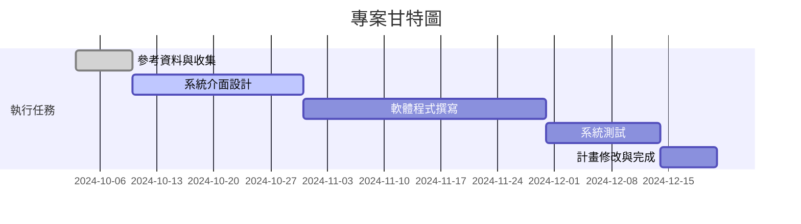
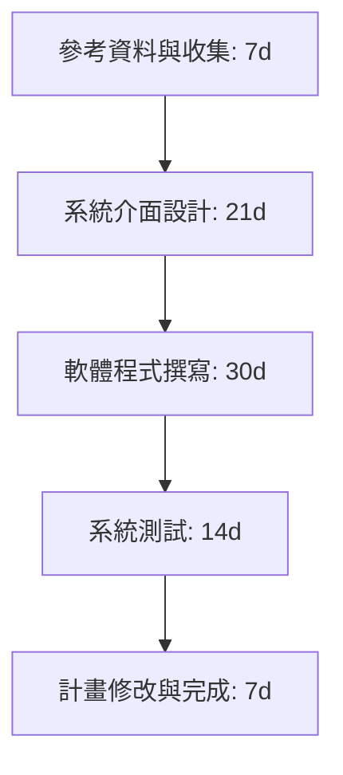
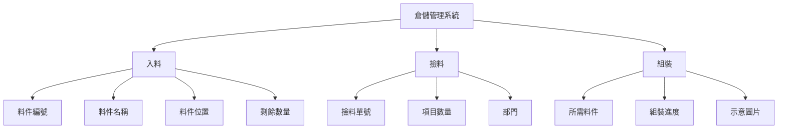

## 混合實境倉儲管理系統
***

```
組長:李昆達
組員:張鈞瑋
組員:田翔銘
組員:徐毓廷
組員:田先勛
```
## 專題內容概要
>本研究將透過設計思考流程，探索場域包括人員行為模式與背後意涵，並以混合實境作為切入工業4.0資訊傳遞過程的改善實作。了解人員對於混和實境的人機協作過程，以及人員對於系統前後的主觀感受與客觀績效等變化有所掌握情況。


## 甘特圖 hw2



## 組員任務hw2
| 組員   | 任務   |
| ------- | ------- | 
| 李昆達   | 程式撰寫   |
| 張鈞瑋   | 程式撰寫   | 
| 田翔銘   | 系統測試   | 
| 徐毓廷   | 介面設計   | 
| 田先勛   | 系統測試   | 

### PERT/CPM hw2

## 功能性與非功能性需求 hw3
>功能性需求：
 <br>1.用戶註冊：作業人員需要輸入帳號密碼方可登入頁面。
<br>2.貨料資訊：頁面會依照作業人員行爲顯示該貨架或貨格的資訊
<br>3.操作警示：若作業人員放置錯誤地方，頁面會顯示警告頁面提醒人員<br>
>非功能性需求：
 <br>1.效能：系統的頁面加載時間應該不超過 5 秒。
 <br>2.安全性：用戶資料應該以加密的方式儲存，確保安全
 <br>3.承載性：系統要確保流量的穩定，避免應系統線上同時太多人所造成的壅塞狀況

## 功能分解圖FDD hw3
倉儲管理系統


## 使用案例圖


