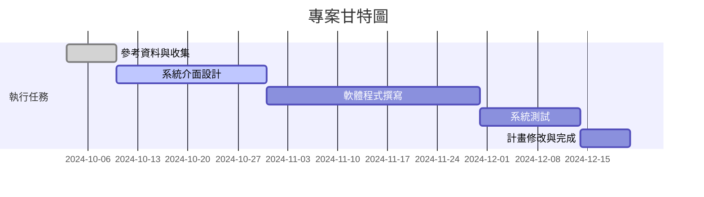

## 混合實境倉儲管理系統

***

```
組長:李昆達
組員:張鈞瑋
組員:田翔銘
組員:徐毓廷
組員:田先勛
```
## 專題內容概要
>本研究將透過設計思考流程，探索場域包括人員行為模式與背後意涵，並以混合實境作為切入工業4.0資訊傳遞過程的改善實作。了解人員對於混和實境的人機協作過程，以及人員對於系統前後的主觀感受與客觀績效等變化有所掌握情況。


## 甘特圖



## 組員任務
| 組員   | 任務   |
| ------- | ------- | 
| 李昆達   | 程式撰寫   |
| 張鈞瑋   | 程式撰寫   | 
| 田翔銘   | 系統測試   | 
| 徐毓廷   | 介面設計   | 
| 田先勛   | 系統測試   | 


