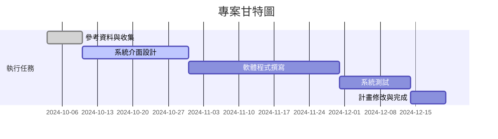
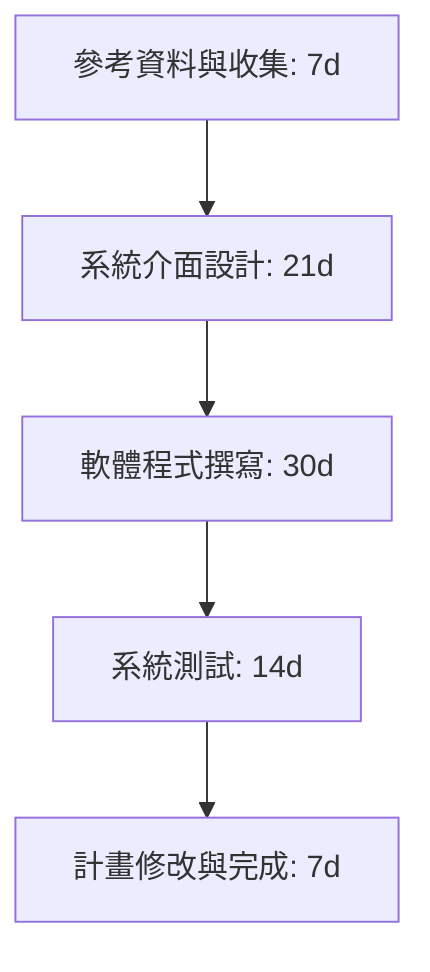
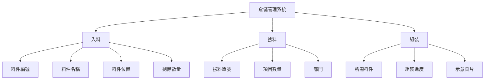
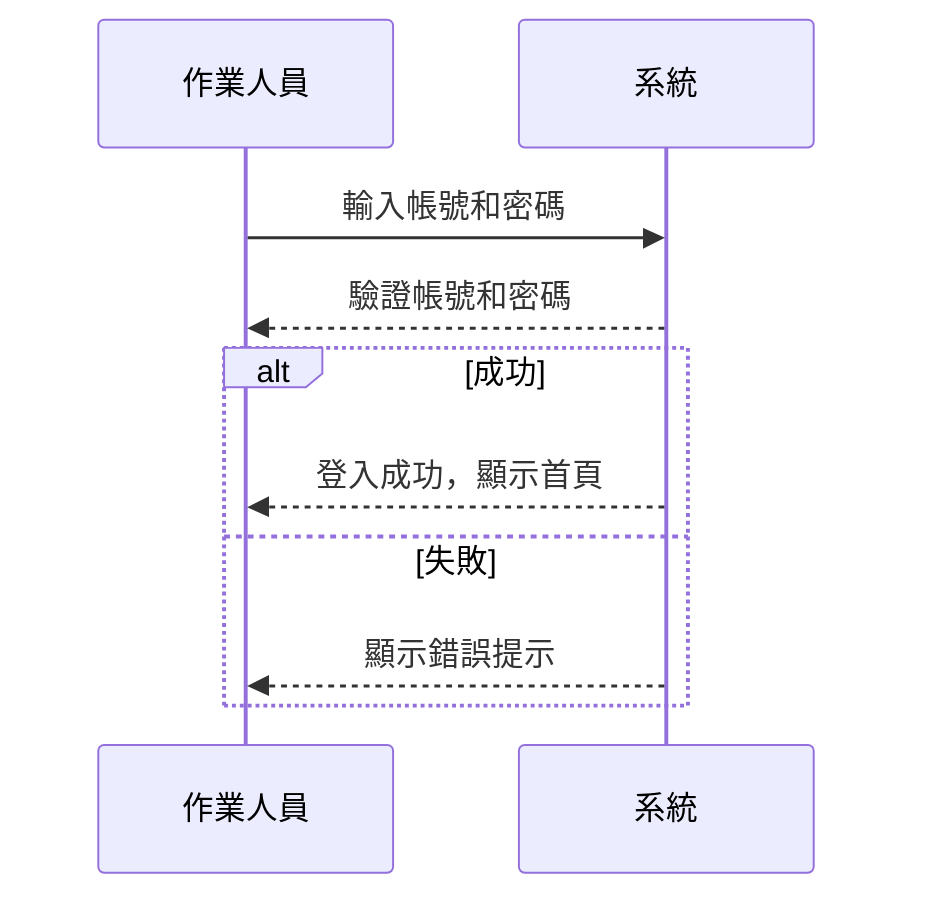
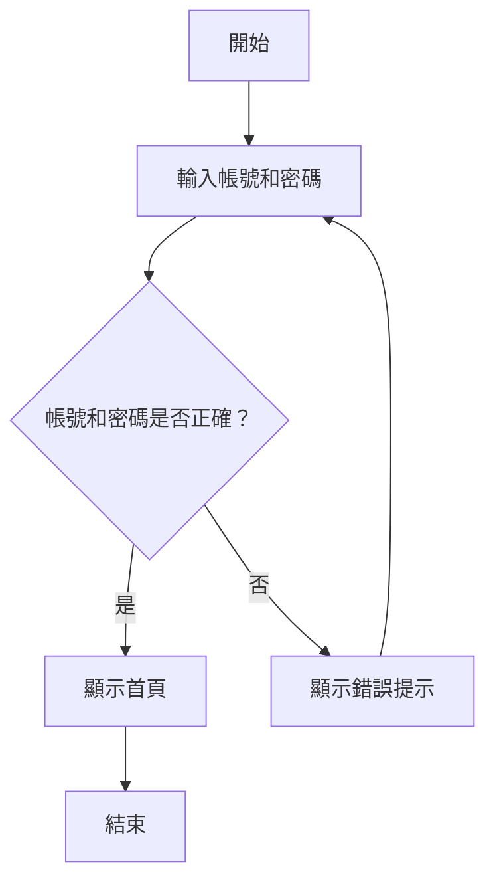

## 混合實境倉儲管理系統
***

```
組長:李昆達
組員:張鈞瑋
組員:田翔銘
組員:徐毓廷
組員:田先勛
```
## 專題內容概要
>本研究將透過設計思考流程，探索場域包括人員行為模式與背後意涵，並以混合實境作為切入工業4.0資訊傳遞過程的改善實作。了解人員對於混和實境的人機協作過程，以及人員對於系統前後的主觀感受與客觀績效等變化有所掌握情況。


## 甘特圖 hw2



## 組員任務hw2
| 組員   | 任務   |
| ------- | ------- | 
| 李昆達   | 程式撰寫   |
| 張鈞瑋   | 程式撰寫   | 
| 田翔銘   | 系統測試   | 
| 徐毓廷   | 介面設計   | 
| 田先勛   | 系統測試   | 

### PERT/CPM hw2

## 功能性與非功能性需求 hw3
>功能性需求：
 <br>1.用戶註冊：作業人員需要輸入帳號密碼方可登入頁面。
<br>2.貨料資訊：頁面會依照作業人員行爲顯示該貨架或貨格的資訊
<br>3.操作警示：若作業人員放置錯誤地方，頁面會顯示警告頁面提醒人員<br>
>非功能性需求：
 <br>1.效能：系統的頁面加載時間應該不超過 5 秒。
 <br>2.安全性：用戶資料應該以加密的方式儲存，確保安全
 <br>3.承載性：系統要確保流量的穩定，避免應系統線上同時太多人所造成的壅塞狀況

## 功能分解圖FDD hw3


## 使用案例圖 hw3


# 使用案例 1：用戶註冊與登入

### 說明：
作業人員必須輸入帳號和密碼，才能登入系統進行操作。

### 主要流程：
1. 作業人員輸入帳號及密碼。
2. 系統驗證用戶的身份。
3. 驗證成功後，系統顯示倉儲管理系統的首頁。


### 例外情況：
- 若帳號或密碼輸入錯誤，系統顯示錯誤提示，並要求重新輸入。
# 使用案例 2：貨料資訊查詢

### 說明：
作業人員根據自己的行為（如入料或撿料）查詢特定貨架或貨格的貨料資訊。

### 主要流程：
1. 作業人員選擇入料、撿料或組裝操作。
2. 系統自動顯示該操作相關的貨架或貨格資訊：
   - **入料**：顯示料件編號、料件名稱、料件位置及剩餘數量。
   - **撿料**：顯示撿料單號、項目數量及部門。
   - **組裝**：顯示所需料件、組裝進度及示意圖片。

### 例外情況：
- 若無法查詢到對應的貨料資訊，系統提示「無對應資料」。

# 使用案例 3：操作警示

### 說明：
作業人員在放置料件時，若放置錯誤的貨架或貨格，系統會自動警示。

### 主要流程：
1. 作業人員放置料件至特定位置。
2. 系統檢查料件的放置位置是否正確。
3. 若正確，系統無提示並繼續。
4. 若錯誤，系統顯示警告頁面，提醒作業人員重新確認放置位置。

### 例外情況：
- 如果系統無法自動檢測放置位置，系統會提示作業人員進行人工檢查。
### 系統環境圖 (System DFD)


### 資料流向圖0 (DFD 0)


使用案例 1：用戶註冊與登入
### 循序圖

### 活動圖

